## SpringSecurity


### 1 网络安全基础


#### 1.1 搭建登录的测试用例

##### 1.1.1 创建项目

​	创建javaee项目，导入依赖

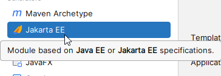

​	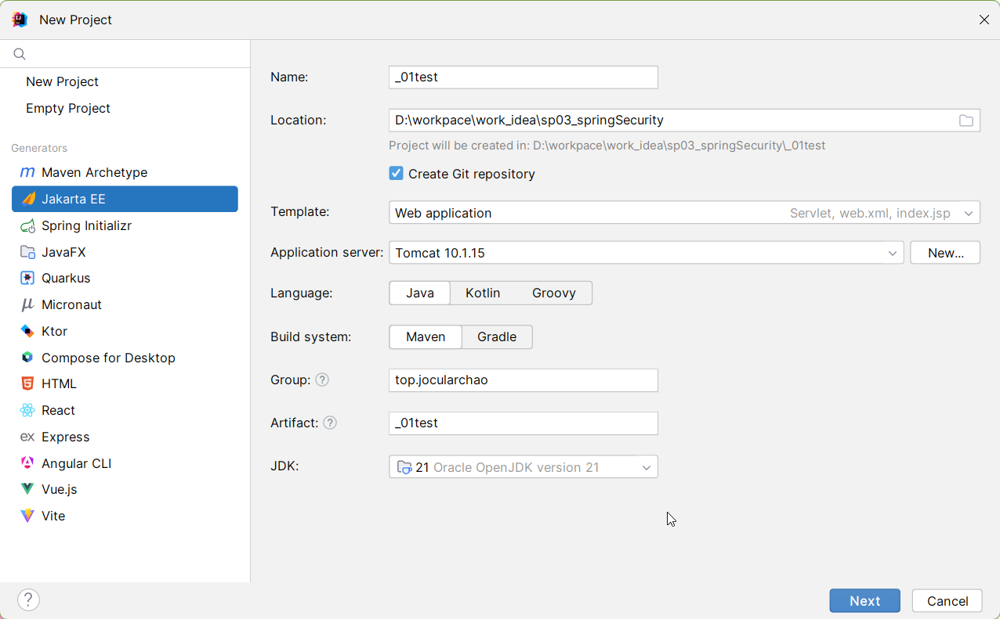

依赖

##### 1.1.2 规范化目录


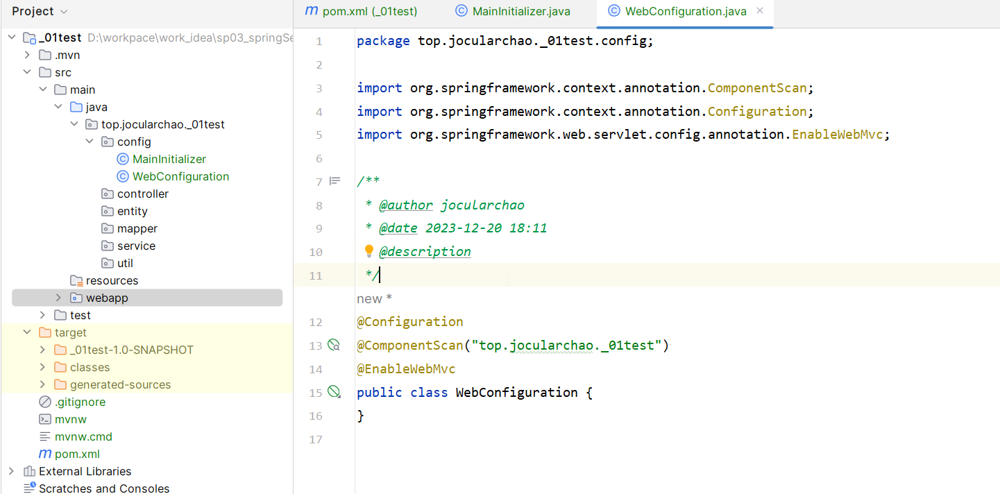


#### 1.2 CSRF跨站请求伪造攻击


#### 1.3 SFA会话固定攻击


#### 1.4 XSS跨站脚本攻击


### 2 开发环境配置

#### 2.1 先导入依赖

```xml
<dependencies>
        <!--spring框架依赖-->
        <dependency>
            <groupId>org.springframework.security</groupId>
            <artifactId>spring-security-web</artifactId>
            <version>6.1.5</version>
        </dependency>
        <dependency>
            <groupId>org.springframework.security</groupId>
            <artifactId>spring-security-config</artifactId>
            <version>6.1.5</version>
        </dependency>
        <dependency>
            <groupId>org.springframework</groupId>
            <artifactId>spring-webmvc</artifactId>
            <version>6.0.13</version>
        </dependency>

        <!--视图解析-->
        <dependency>
            <groupId>org.thymeleaf</groupId>
            <artifactId>thymeleaf-spring6</artifactId>
            <version>3.1.2.RELEASE</version>
        </dependency>

        <!--持久层依赖-->
        <dependency>
            <groupId>com.mysql</groupId>
            <artifactId>mysql-connector-j</artifactId>
            <version>8.2.0</version>
        </dependency>
        <dependency>
            <groupId>org.mybatis</groupId>
            <artifactId>mybatis-spring</artifactId>
            <version>3.0.2</version>
        </dependency>
        <dependency>
            <groupId>org.mybatis</groupId>
            <artifactId>mybatis</artifactId>
            <version>3.5.14</version>
        </dependency>
        <dependency>
            <groupId>org.springframework</groupId>
            <artifactId>spring-jdbc</artifactId>
            <version>6.0.13</version>
        </dependency>
        <dependency>
            <groupId>com.zaxxer</groupId>
            <artifactId>HikariCP</artifactId>
            <version>5.1.0</version>
        </dependency>

        <!--lombok、slf4j-->
        <dependency>
            <groupId>org.projectlombok</groupId>
            <artifactId>lombok</artifactId>
            <version>1.18.30</version>
        </dependency>
        <dependency>
            <groupId>org.slf4j</groupId>
            <artifactId>slf4j-api</artifactId>
            <version>2.0.9</version>
        </dependency>
        <dependency>
            <groupId>org.slf4j</groupId>
            <artifactId>slf4j-jdk14</artifactId>
            <version>2.0.9</version>
        </dependency>

        <!--servletAPI-->
        <dependency>
            <groupId>jakarta.servlet</groupId>
            <artifactId>jakarta.servlet-api</artifactId>
            <version>6.0.0</version>
        </dependency>

        <!--junit测试-->
        <dependency>
            <groupId>org.junit.jupiter</groupId>
            <artifactId>junit-jupiter-api</artifactId>
            <version>${junit.version}</version>
            <scope>test</scope>
        </dependency>
        <dependency>
            <groupId>org.junit.jupiter</groupId>
            <artifactId>junit-jupiter-engine</artifactId>
            <version>${junit.version}</version>
            <scope>test</scope>
        </dependency>
    </dependencies>
```

#### 2.2 初始化类

```java
public class MainInitializer extends AbstractAnnotationConfigDispatcherServletInitializer {
    @Override
    protected Class<?>[] getRootConfigClasses() {
        return new Class[]{RootConfiguration.class};
    }

    @Override
    protected Class<?>[] getServletConfigClasses() {
        return new Class[]{MvcConfiguration.class};
    }

    @Override
    protected String[] getServletMappings() {
        return new String[]{"/"};
    }
}
```


#### 2.3 mvc配置类

```java
@Configuration
@EnableWebMvc
@ComponentScan("top.jocularchao._03template.controller")
public class MvcConfiguration implements WebMvcConfigurer {


    //我们需要使用ThymeleafViewResolver作为视图解析器，并解析我们的HTML页面
    @Bean
    public ThymeleafViewResolver thymeleafViewResolver(@Autowired SpringTemplateEngine springTemplateEngine){
        ThymeleafViewResolver resolver = new ThymeleafViewResolver();
        resolver.setOrder(1);
        resolver.setCharacterEncoding("UTF-8");
        resolver.setTemplateEngine(springTemplateEngine);
        return resolver;
    }

    //配置模板解析器
    @Bean
    public SpringResourceTemplateResolver templateResolver(){
        SpringResourceTemplateResolver resolver = new SpringResourceTemplateResolver();
        resolver.setSuffix(".html");
        resolver.setPrefix("/template/");
        return resolver;
    }

    //配置模板引擎Bean
    @Bean
    public SpringTemplateEngine springTemplateEngine(@Autowired ITemplateResolver resolver){
        SpringTemplateEngine engine = new SpringTemplateEngine();
        engine.setTemplateResolver(resolver);
        return engine;
    }

    //开启静态资源处理
    @Override
    public void configureDefaultServletHandling(DefaultServletHandlerConfigurer configurer) {
        configurer.enable();
    }

    //静态资源路径配置
    @Override
    public void addResourceHandlers(ResourceHandlerRegistry registry) {
        registry.addResourceHandler("/static/**").addResourceLocations("/static/");
    }
}
```


#### 2.4 Root配置类

**RootConfiguration**

```java
@Configuration
public class RootConfiguration {
}
```


#### 2.5 响应页面

创建一个专用于响应页面的Controller：

```java
/**
 * 专用于处理页面响应的控制器
 */
@Controller
public class PageController {

    @RequestMapping("/index")
    public String login(){
        return "index";
    }
}
```


启动项目进行测试


#### 2.6 配置SpringSecurity

SpringSecurity初始化器

```java
public class SecurityInitializer extends AbstractSecurityWebApplicationInitializer {
    //不用重写任何内容
    //这里实际上会自动注册一个Filter，SpringSecurity底层就是依靠N个过滤器实现的，我们之后再探讨
}
```

配置类

```java
@Configuration
@EnableWebSecurity
public class SecurityConfiguration extends WebSecurityConfigurerAdapter {
//继承WebSecurityConfigurerAdapter，之后会进行配置

}
```

在根容器添加此配置文件

```java
@Override
protected Class<?>[] getRootConfigClasses() {
    return new Class[]{RootConfiguration.class, SecurityConfiguration.class};
}
```

#### 2.7 完成

配置完成再次进入我们会发现无论我们访问哪个页面都会是这个页面

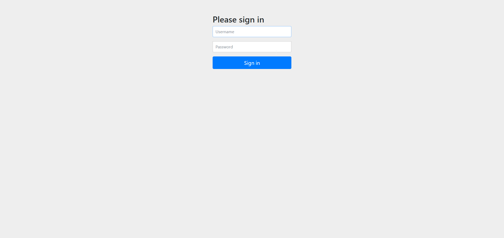

成功！

### 3 认证

认证是我们网站的第一步，用户需要登录之后才能进入，这一部分我们将详细介绍如何使用SpringSecurity实现用户登录。

#### 3.1 基于内存认证

最简单的基于内存的配置，即我们直接以代码的形式配置我们网站的用户和密码，配置方式非常简单，只需要在Security配置类中注册一个Bean即可：

```java
//1 基于内存认证
//UserDetailsService就是获取用户信息的服务
@Bean
public UserDetailsService userDetailsService() {
    //每一个UserDetails就代表一个用户信息，其中包含用户的用户名和密码以及角色
    UserDetails user = User.withDefaultPasswordEncoder()
            .username("user")
            .password("password")
            .roles("USER")  //角色目前我们不需要关心
            .build();
    UserDetails admin = User.withDefaultPasswordEncoder()
            .username("admin")
            .password("password")
            .roles("ADMIN","USER")
            .build();

    return new InMemoryUserDetailsManager(user,admin);
}
```

这样输出账号密码后，就能进入页面了，若想退出就输入http://localhost:8080/logout

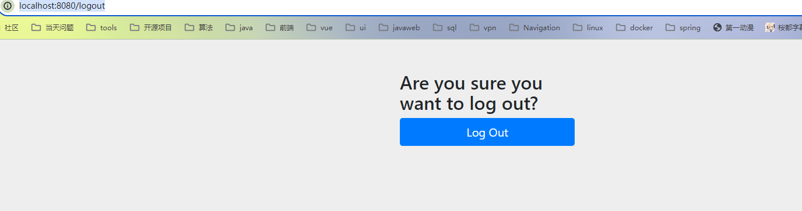

就可以退出了

所以我们的网站可以不写登录模块，因为所有的模块都不需要验证了，security已经帮我们做了

##### 3.1.1 加密

> 我们在配置用户信息的时候，报了黄标，实际上这种方式存储密码并不安全：
>
> 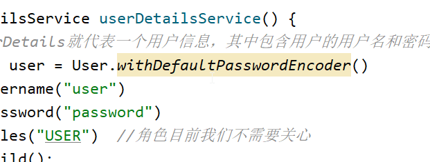
>
> 这是因为SpringSecurity的密码校验不推荐直接使用原文进行比较，而是使用加密算法将密码进行加密（更准确地说应该进行Hash处理，此过程是不可逆的，无法解密），最后将用户提供的密码以同样的方式加密后与密文进行比较。对于我们来说，用户提供的密码属于隐私信息，直接明文存储并不好，而且如果数据库内容被窃取，那么所有用户的密码将全部泄露，这是我们不希望看到的结果，我们需要一种既能隐藏用户密码也能完成认证的机制，而Hash处理就是一种很好的解决方案，通过将用户的密码进行Hash值计算，计算出来的结果一般是单向的，无法还原为原文，如果需要验证是否与此密码一致，那么需要以同样的方式加密再比较两个Hash值是否一致，这样就很好的保证了用户密码的安全性。

因此，我们在配置用户信息的时候，可以使用官方提供的BCrypt加密工具：

```java
//1 使用官方提供的BCrypt加密工具更好的加密
//这里将BCryptPasswordEncoder直接注册为Bean，Security会自动进行选
@Bean
public PasswordEncoder passwordEncoder() {
    return new BCryptPasswordEncoder();
}

@Bean
public UserDetailsService userDetailsService(PasswordEncoder encoder) {
    UserDetails user = User
            .withUsername("user")
            .password(encoder.encode("password"))   //这里将密码进行加密后存储
            .roles("USER")
            .build();
    System.out.println(encoder.encode("password"));  //一会观察一下加密出来之后的密码长啥样
    UserDetails admin = User
            .withUsername("admin")
            .password(encoder.encode("password"))   //这里将密码进行加密后存储
            .roles("ADMIN", "USER")
            .build();
    return new InMemoryUserDetailsManager(user, admin);
}
```

这样就对密码进行了加密

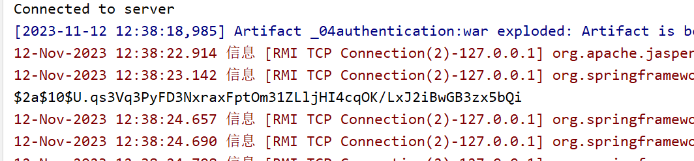

BCrypt加密方式：

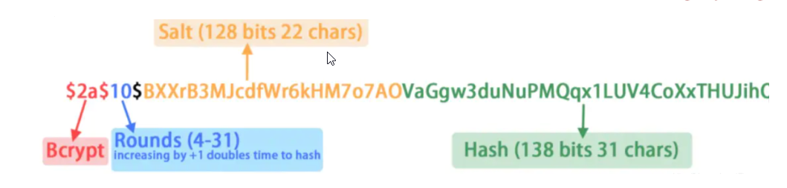

##### 3.1.2 post请求403

所有的POST请求都被403了

```html
<form method="post" action="success">
    <input type="text">
    <input type="submit">
</form>
```

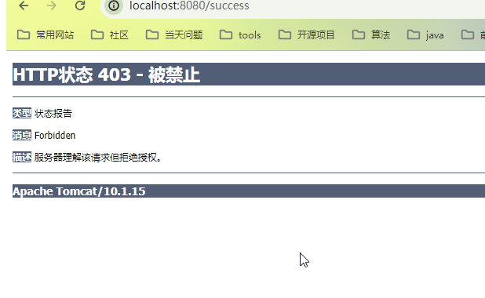

这是因为SpringSecurity自带了csrf防护，需求我们在POST请求中携带页面中的csrfToken才可以，否则一律进行拦截操作，这里我们可以将其嵌入到页面中，随便找一个地方添加以下内容：

```html
<form method="post" action="success">
    <input type="text" th:name="${_csrf.getParameterName()}" th:value="${_csrf.token}" hidden>
    <input type="text">
    <input type="submit">
</form>
```

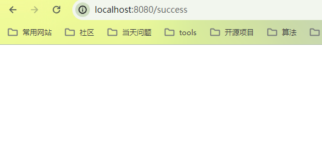

实际上现在的浏览器已经很安全了，完全不需要使用自带的csrf防护。所以我们后面会配置关闭csrf防护

所以，在实战项目中，遇到了401、403这种错误，优先查看springsecurity配置是否错误

> 从Spring Security 4.0开始，默认情况下会启用CSRF保护，以防止CSRF攻击应用程序，Spring Security CSRF会针对PATCH，POST，PUT和DELETE方法的请求（不仅仅只是登陆请求，这里指的是任何请求路径）进行防护，而这里的登陆表单正好是一个POST类型的请求。在默认配置下，无论是否登陆，页面中只要发起了PATCH，POST，PUT和DELETE请求一定会被拒绝，并返回**403**错误**（注意，这里是个究极大坑，这个没有任何提示，直接403，因此如果你不知道的话根本不清楚是什么问题，就一直卡这里了）**，需要在请求的时候加入csrfToken才行，也就是"83421936-b84b-44e3-be47-58bb2c14571a"，正是csrfToken，如果提交的是表单类型的数据，那么表单中必须包含此Token字符串，键名称为"_csrf"；如果是JSON数据格式发送的，那么就需要在请求头中包含此Token字符串。


#### 3.2 基于数据库认证

将用户信息存储在数据库中，就需要与数据库连接，通过查询数据库中的用户信息来进行用户登录

其实官方默认提供了可以直接使用的用户和权限表设计，根本不需要我们来建表，直接在Navicat中执行以下查询：

```sql
-- 官方默认提供了可以直接使用的用户和权限表设计，根本不需要我们来建表

create table users
(
    username varchar(50)  not null primary key,
    password varchar(500) not null,
    enabled  boolean      not null
);

create table authorities
(
    username  varchar(50) not null,
    authority varchar(50) not null,
    constraint fk_authorities_users foreign key (username) references users (username)
);

create unique index ix_auth_username on authorities (username, authority);
```


##### 依赖

```xml
<!--持久层依赖-->
<dependency>
    <groupId>com.mysql</groupId>
    <artifactId>mysql-connector-j</artifactId>
    <version>8.2.0</version>
</dependency>
<dependency>
    <groupId>org.mybatis</groupId>
    <artifactId>mybatis-spring</artifactId>
    <version>3.0.2</version>
</dependency>
<dependency>
    <groupId>org.mybatis</groupId>
    <artifactId>mybatis</artifactId>
    <version>3.5.14</version>
</dependency>
<dependency>
    <groupId>org.springframework</groupId>
    <artifactId>spring-jdbc</artifactId>
    <version>6.0.13</version>
</dependency>
<dependency>
    <groupId>com.zaxxer</groupId>
    <artifactId>HikariCP</artifactId>
    <version>5.1.0</version>
</dependency>
```


##### 配置类

```java
//2 基于数据库验证
//密码加密
@Bean
PasswordEncoder passwordEncoder() {
    return new BCryptPasswordEncoder();    
}


//数据库连接
@Bean
public DataSource dataSource() {
    //配置数据源
    return new PooledDataSource("com.mysql.cj.jdbc.Driver","jdbc:mysql://localhost:3306/jdbc_test","root"
    ,"123456");
}

//交互
@Bean
public UserDetailsService userDetailsService(DataSource dataSource,PasswordEncoder encoder) {
    JdbcUserDetailsManager manager = new JdbcUserDetailsManager(dataSource);
    //
    manager.createUser(User
            .withUsername("user")
            .password(encoder.encode("password"))
            .roles("USER")
            .build()
    );  
    return manager;

}
```

启动项目后，发现数据库中多了两个数据：

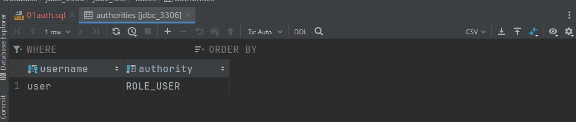

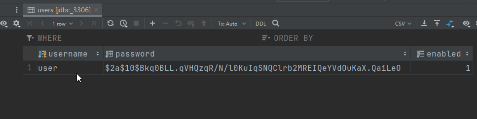

完成！！


重置密码


#### 3.3 基于自定义认证


#### 3.4 UserDetailsManager接口

无论是**InMemoryUserDetailsManager**还是**JdbcUserDetailsManager**，他们都是实现自**UserDetailsManager**接口

这个接口有着一套完整的增删改查操作，方便我们直接对用户进行处理：

```java
package org.springframework.security.provisioning;

import org.springframework.security.core.userdetails.UserDetails;
import org.springframework.security.core.userdetails.UserDetailsService;

public interface UserDetailsManager extends UserDetailsService {
    //创建一个新的用户
    void createUser(UserDetails user);

    //更新用户信息
    void updateUser(UserDetails user);

    //删除用户
    void deleteUser(String username);

    //修改用户密码
    void changePassword(String oldPassword, String newPassword);

    //判断是否存在指定用户
    boolean userExists(String username);
}
```


##### 3.4.1 重置密码

​	通过使用UserDetailsManager对象，我们就能快速执行用户相关的管理操作，比如我们可以直接在网站上添加一个快速重置密码的接口，首先需要配置一下JdbcUserDetailsManager，为其添加一个AuthenticationManager用于原密码的校验：

```java
//2 密码重置
//密码加密
@Bean
PasswordEncoder passwordEncoder() {
    return new BCryptPasswordEncoder();
}


//数据库连接
@Bean
public DataSource dataSource() {
    //配置数据源
    return new PooledDataSource("com.mysql.cj.jdbc.Driver","jdbc:mysql://localhost:3306/jdbc_test","root"
    ,"123456");
}

//手动创建一个AuthenticationManager用于处理密码校验
private AuthenticationManager authenticationManager(UserDetailsManager manager,
                                                    PasswordEncoder encoder){
    DaoAuthenticationProvider provider = new DaoAuthenticationProvider();
    provider.setUserDetailsService(manager);
    provider.setPasswordEncoder(encoder);
    return new ProviderManager(provider);
}

//交互
@Bean
public UserDetailsService userDetailsService(DataSource dataSource, PasswordEncoder encoder) {
    JdbcUserDetailsManager manager = new JdbcUserDetailsManager(dataSource);
    manager.setAuthenticationManager(authenticationManager(manager, encoder));

    return manager;

}
```

编写一个快速重置密码的接口：


接着我们在主界面添加一个重置密码的操作：


### 4 其他配置


#### 4.1 自定义登录界面


#### 4.2 记住我功能


### 5 授权


#### 5.1 基于角色授权


#### 5.2 基于权限授权


